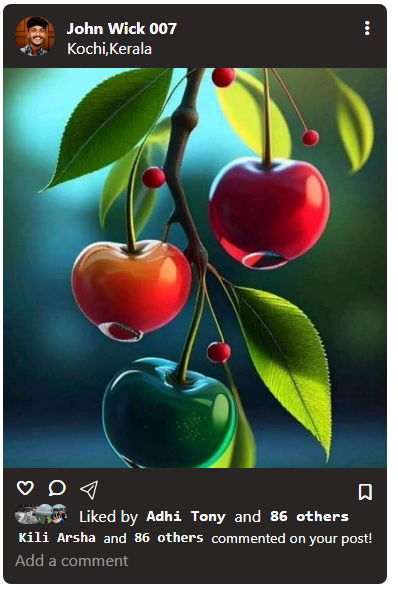

## Instagram
[live@](https://instapagebibin.netlify.app/)
📸 Instagram UI Clone (HTML + TailwindCSS)

This project is a simple Instagram-style post layout created using HTML, TailwindCSS, and Font Awesome Icons.
It demonstrates how to structure a social media card with profile details, an image post, and interaction icons.

🚀 Features

📌 Instagram-like post card

👤 Profile section with avatar and location

🖼️ Post image display

❤️ Like, 💬 Comment, ✈️ Share, and 🔖 Save icons

👍 Likes preview using overlapping profile pictures

💬 Comment input box

🎨 Styled with TailwindCSS v4 (CDN)

🔠 Icons from Font Awesome 7

🧱 Project Structure
/
│── index.html
│── profile pic.png
│── img.jpg
│── adhi.png
│── kili.png
│── choonda.png
│── README.md

